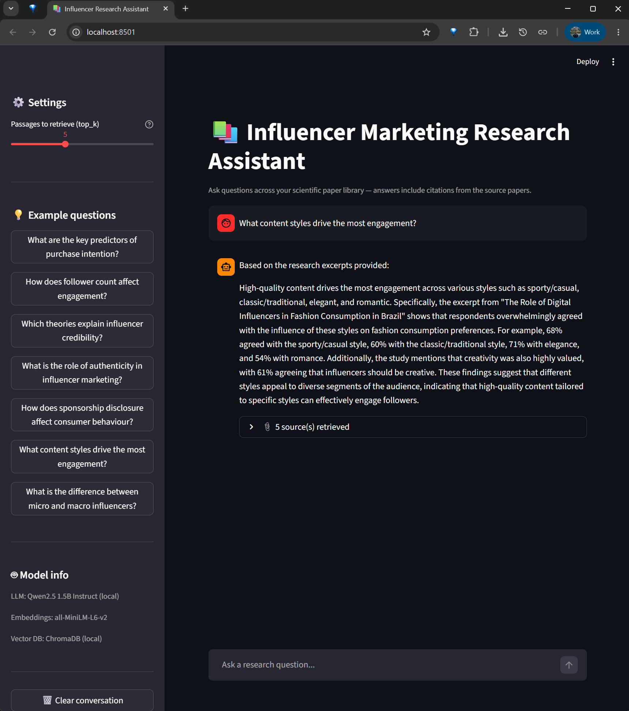

# 📚 Influencer Research RAG


A local RAG-powered assistant that lets you ask questions about influencer marketing research papers and actually get useful answers — with citations, not hallucinations.

I work in influencer marketing analytics and kept running into the same problem: too many papers, too little time, and no easy way to cross-reference findings across studies. Built this so I could ask natural language questions across my research library and get answers grounded in actual academic sources — not generic LLM knowledge.

> 🔒 Runs 100% locally. No data is sent to external APIs. Your papers stay on your machine.

---

## Demo


*Ask a question, get a cited answer pulled directly from your papers.*

---

## What it does

You throw a bunch of scientific papers into a folder, run one command, and suddenly you have a chat interface where you can ask things like:

- *"What does the research say about the impact of follower count on engagement?"*
- *"Which theories explain influencer credibility?"*
- *"What are the most consistent predictors of purchase intention?"*

And instead of getting a generic LLM answer pulled from thin air, you get a response grounded in your actual papers — with references to which paper and page it came from.

---

## How it works

Nothing too exotic going on here. The architecture is pretty much textbook RAG:

```
Your PDFs
    ↓
Extract text page by page (pdfplumber)
    ↓
Split into overlapping chunks of ~400 words
    ↓
Convert each chunk into a vector (all-MiniLM-L6-v2)
    ↓
Store everything in a local ChromaDB database
    ↓
User asks a question
    ↓
Question gets embedded → ChromaDB finds the most similar chunks
    ↓
Those chunks + the question get sent to Qwen2.5 1.5B
    ↓
Answer with citations
```

The model never "searches" anything — it just reads whatever context we feed it and writes a response. All the smart retrieval happens before the LLM even gets involved.

---

## Folder structure

```
influencer-research-rag/
│
├── papers/           # Drop your PDFs here
├── chroma_db/        # Auto-generated — don't touch this
├── images/           # Put your demo screenshot here
├── app.py            # Streamlit UI
├── ingest.py         # PDF → chunks → embeddings → ChromaDB
├── rag.py            # Retrieval + generation logic
├── requirements.txt
└── .env              # Your API keys if needed
```

---

## Stack

| Component | Tool | Why |
|-----------|------|-----|
| PDF parsing | pdfplumber | Reliable, handles academic PDFs well |
| Embeddings | all-MiniLM-L6-v2 | Small, fast, good enough for semantic search |
| Vector DB | ChromaDB | Local, zero config, persists to disk |
| LLM | Qwen2.5 1.5B Instruct | Runs on CPU, no GPU needed, surprisingly decent |
| UI | Streamlit | Gets out of the way and just works |

---

## Setup

**1. Clone and navigate to the project:**
```bash
cd influencer-research-rag
```

**2. Install dependencies with Poetry:**
```bash
poetry install
poetry shell
```

**3. Add your PDFs to the `papers/` folder**

**4. Ingest your papers (run once, or whenever you add new ones):**
```bash
python ingest.py
```

First run will download the embedding model (~80MB). Subsequent runs are fast and only process new files — already ingested papers are skipped automatically.

**5. Launch the app:**
```bash
streamlit run app.py
```

Opens at `http://localhost:8501`.

---

## Design decisions worth mentioning

**Why chunking with overlap?**
Splitting text into chunks is necessary because you can't feed an entire paper to the LLM — context windows have limits and it gets expensive fast. The 50-word overlap between chunks means you don't lose context at the boundaries. A sentence that starts at the end of chunk 1 will also appear at the start of chunk 2.

**Why a local model instead of GPT-4 or Claude?**
Keeping everything local was a deliberate choice — no API costs, no data leaving the machine, and working with local models is a genuinely useful skill. Qwen2.5 1.5B is small enough to run on a regular laptop CPU while still being coherent enough for this use case. Swapping to a larger model is one line change in `rag.py` if you have the hardware.

**Why ChromaDB over FAISS or Pinecone?**
For a project of this size (a few dozen papers at most), ChromaDB is the least friction option — it persists to disk automatically, has a clean Python API, and doesn't require spinning up any external services. FAISS would be faster at scale but requires manual save/load logic. Pinecone is great for production but overkill here.

**Incremental ingestion**
The ingest script checks what's already in the database before processing anything. So if you add 2 new papers to a collection of 20, it only processes the 2 new ones. Saves a lot of time once your library grows.

---

## Limitations

- **CPU-only means slower answers.** Running a 1.5B model on CPU takes 20-40 seconds per answer — a conscious tradeoff to keep everything self-contained and hardware-agnostic. Set `device_map="auto"` in `rag.py` if you have a GPU and want faster responses.
- **PDF extraction isn't magic.** Papers with complex layouts, two-column formats, or lots of tables may not extract perfectly. If answers seem off for a specific paper, check whether pdfplumber is parsing it cleanly.
- **No re-ranking.** Retrieval is pure vector similarity — there's no cross-encoder re-ranking step to further filter results. Adding one would improve answer quality for complex or ambiguous questions.
- **No hybrid search.** Pure vector search can miss very specific terms, author names, or acronyms. Combining with BM25 keyword search would improve recall for exact-term queries.

---

## Possible next steps

- Add a cross-encoder re-ranker between retrieval and generation
- Hybrid search (vector + BM25 keyword) for better recall on specific terms
- Add metadata filters (e.g. "only search papers from 2022 onwards")
- Export Q&A sessions as a structured report

---

Built by Rafael Belokurows · [LinkedIn](https://www.linkedin.com/in/rafabws) · [GitHub](https://github.com/rafabelokurows)
